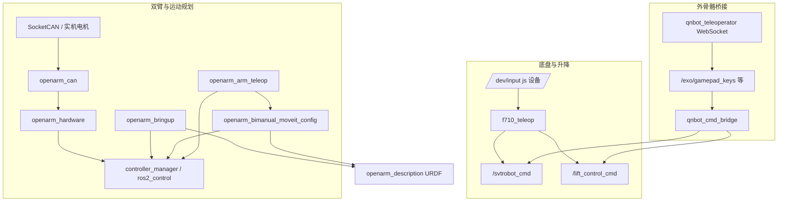

# ros2_ws 概览

本工作空间集成 **OpenArm 双臂 ROS 2 栈**、**手柄/外骨骼遥操作**，以及 **底盘与升降桥接**。下文为软件清单、简要使用步骤与系统架构。

---

## 软件清单

| 组件 | 类型 | 说明 |
|------|------|------|
| `openarm` | ROS 2 元包 | 聚合 bringup、description、hardware |
| `openarm_description` | ROS 2 | URDF / xacro 模型与可视化相关依赖 |
| `openarm_hardware` | ROS 2 | `ros2_control` 硬件插件，经 `openarm_can` 访问 CAN |
| `openarm_can` | ROS 2 / C++ 库 | 与实机达妙电机等的底层 CAN 通信 |
| `openarm_bringup` | ROS 2 | 单机 / 双臂启动（控制器、状态、RViz 等） |
| `openarm_bimanual_moveit_config` | ROS 2 | MoveIt 2 配置与 `demo.launch.py` 等 |
| `openarm_arm_teleop` | ROS 2 (Python) | F710 双臂关节或末端（IK）遥操作 |
| `f710_teleop` | ROS 2 (Python) | F710 读 `/dev/input/js*`，发 `/svtrobot_cmd`、`/lift_control_cmd` |
| `qnbot_teleoperator` | ROS 2 (Python) | WebSocket 外骨骼遥操作，发布 `/exo/*` 等 |
| `qnbot_cmd_bridge` | ROS 2 (Python) | 将 `/exo/gamepad_keys` 桥接到与 F710 相同的话题 |
| `openarm_teleop` | C++ (CMake) | 低层双边/单边控制等可执行程序（依赖系统 `OpenArmCAN` 等） |
| `openarm_sdk` | Python (pip) | 基于 CAN 的高级 Python SDK，非 colcon 包 |

各包详细说明见对应目录下的 `README.md`。

---

## 环境依赖（摘要）

- **ROS 2**：建议 **Humble**（与仓库内文档一致）。
- **实机**：Linux **SocketCAN**、`libopenarm-can` / 文档中的 CAN 配置；双臂控制需正确 CAN 口与权限。
- **末端 IK 遥操作**：需 **MoveIt** 相关包随 `openarm_bimanual_moveit_config` 安装齐全。
- **F710**：Linux 下手柄设备（如 `/dev/input/js1`）及 `input` 组或 udev 权限。

---

## 使用教程（简版）

### 1. 编译工作空间

```bash
cd ~/ros2_ws   # 或本仓库根目录
source /opt/ros/humble/setup.bash
colcon build
source install/setup.bash
```

按需只编指定包：`colcon build --packages-select <包名>`。  
标准 ROS 2 包以各目录下的 `package.xml` 为准；`src/openarm_teleop` 等为独立 CMake 工程时需按其目录说明单独配置编译。

### 2. 双臂真机 + MoveIt + 手柄末端控制

**终端 1** — 双臂 bringup：

```bash
ros2 launch openarm_bringup openarm.bimanual.launch.py arm_type:=v10
```

**终端 2** — MoveIt（提供 IK 等）：

```bash
ros2 launch openarm_bimanual_moveit_config demo.launch.py arm_type:=v10
```

**终端 3** — 末端遥操作节点：

```bash
ros2 run openarm_arm_teleop ee_teleop_node
```

或使用统一 launch（关节 / 末端模式）：

```bash
ros2 launch openarm_arm_teleop openarm_arm_teleop.launch.py mode:=joint
ros2 launch openarm_arm_teleop openarm_arm_teleop.launch.py mode:=ee
```

按键映射与检查命令见 `src/openarm_arm_teleop/README.md`。

### 3. 底盘 + 升降（F710 手柄）

```bash
ros2 launch f710_teleop f710_teleop.launch.py
```

话题：`/svtrobot_cmd`（`geometry_msgs/Twist`）、`/lift_control_cmd`（`std_msgs/Int32MultiArray`）。配置见 `src/f710_teleop/README.md`。

### 4. 外骨骼数据桥接到底盘 / 升降（与 F710 同话题）

**终端 1**：

```bash
ros2 launch qnbot_teleoperator websocket_teleoperator.launch.py
```

**终端 2**：

```bash
ros2 launch qnbot_cmd_bridge exo_cmd_bridge.launch.py
```

下游订阅方与使用 F710 时相同。参数见 `src/qnbot_cmd_bridge/config/exo_cmd_bridge.yaml` 与包内 README。

### 5. Python SDK（可选）

安装与示例见仓库内 `openarm_sdk/README.md`（依赖 `openarm_can` 的 Python 绑定与电机初始化流程）。

---

## 系统架构

数据流按功能分成三条主线：**机械臂控制**、**底盘/升降（手柄）**、**外骨骼桥接**。



**说明：**

- **机械臂**：描述与状态经 `openarm_description` + bringup；控制指令经 `ros2_control`；末端手柄模式依赖 MoveIt 提供的 IK 服务。
- **底盘 / 升降**：F710 直接发布标准话题；外骨骼路径经 `qnbot_teleoperator` 再经 `qnbot_cmd_bridge` 对齐到同一话题，便于复用下游节点。

更细的官方文档：<https://docs.openarm.dev/software/ros2/install>。
