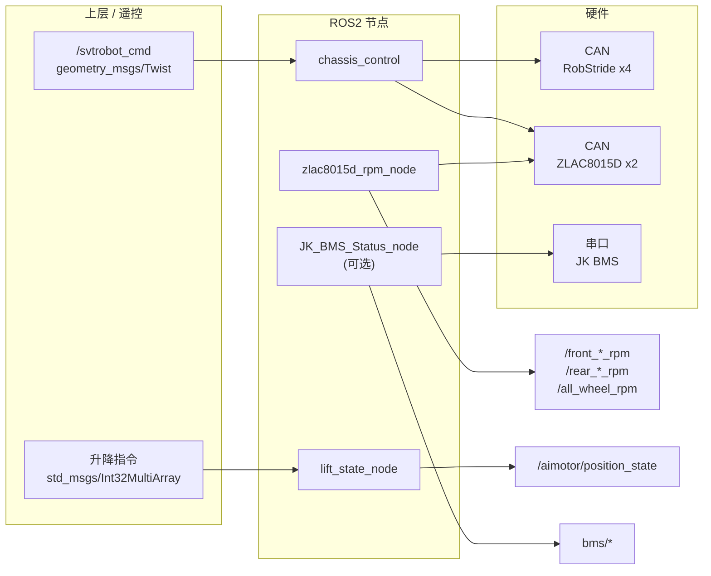

# svtrobo_ws · 底盘控制项目指南（简版）

工作空间根目录：`svtrobo_ws`。当前源码主要为 ROS2 包 **`chassis_control`**。

---

## 1. 软件清单

| 类别 | 名称 | 说明 |
|------|------|------|
| ROS2 包 | `chassis_control` | 底盘转向、轮毂驱动、升降位置、BMS、轮速反馈等 |
| 静态库 | `libchassis_control.so`（构建名） | 封装 `steering_motor`、`wheel_motor`、`filters`、`chassis_control` 等源码 |
| 可执行节点 | `chassis_control` | 主控：订阅速度指令，控制 4 路 RobStride 转向 + 前后 ZLAC8015D 轮毂 |
| 可执行节点 | `lift_state_node` | 升降模组：订阅 `Int32MultiArray` 指令，发布 `/aimotor/position_state` |
| 可执行节点 | `zlac8015d_rpm_node` | 轮速反馈：CAN SDO 读 `0x606C:03`，发布单轮 RPM + `/all_wheel_rpm` |
| 可执行节点 | `JK_BMS_Status_node` | BMS：串口 Modbus，发布 `bms/*` 话题（**未**写入默认 bringup） |
| Launch | `svtrobo_bringup.launch.py` | 一键启动：`chassis_control` + `lift_state_node` + `zlac8015d_rpm_node` |
| 配置 | `config/params.yaml` | 底盘几何、四轮转向初始角等 |
| 脚本 | `scripts/bms_monitor_gui.py` | BMS 监控 GUI（可选） |
| 文档 | `desc/ALL_WHEEL_RPM_USAGE.md` | 轮速 5 个话题说明与订阅示例 |

**依赖（节选）**：`rclcpp`、`std_msgs`、`sensor_msgs`；主控另需 **`geometry_msgs`**（用于 `/svtrobot_cmd`）。

---

## 2. 系统架构



**数据流简述**

- **控制**：`/svtrobot_cmd` → `chassis_control` → 转向电机 + 轮毂驱动器。
- **轮速**：`zlac8015d_rpm_node` 独立轮询 CAN，与主控并行；话题见 `ALL_WHEEL_RPM_USAGE.md`。
- **升降**：`lift_state_node` 独立处理升降电机与位置反馈。

---

## 3. 使用教程

### 3.1 环境

- Ubuntu + ROS2（与工程一致的发行版）
- SocketCAN 已配置（转向 / 轮毂所用 CAN 口与代码或参数一致）
- 升降、BMS 若使用，需对应串口权限（如 `dialout`）

### 3.2 编译

```bash
cd /path/to/svtrobo_ws
colcon build --packages-select chassis_control
source install/setup.bash
```

### 3.3 一键启动（推荐）

```bash
ros2 launch chassis_control svtrobo_bringup.launch.py
```

将同时启动：`chassis_control`、`lift_state_node`、`zlac8015d_rpm_node`，并加载 `config/params.yaml` 到主控节点。

### 3.4 单独启动节点

```bash
ros2 run chassis_control chassis_control      # 需自行加载参数时可加 --ros-args --params-file ...
ros2 run chassis_control lift_state_node
ros2 run chassis_control zlac8015d_rpm_node   # 可传 can_interface、poll_hz 等参数
ros2 run chassis_control JK_BMS_Status_node   # BMS，默认未包含在 bringup
```

### 3.5 常用话题

| 话题 | 类型 | 说明 |
|------|------|------|
| `/svtrobot_cmd` | `geometry_msgs/Twist` | 底盘速度指令（主控订阅） |
| `/aimotor/position_state` | `std_msgs/Float64` | 升降位置状态 |
| 轮速 5 话题 | 见 `desc/ALL_WHEEL_RPM_USAGE.md` | 由 `zlac8015d_rpm_node` 发布 |
| `bms/*` | 多种 | 由 `JK_BMS_Status_node` 发布 |

### 3.6 快速自检

```bash
ros2 topic list
ros2 topic echo /svtrobot_cmd --once
ros2 topic echo /all_wheel_rpm
```

---

*文档随代码演进，若 launch 或话题有变更，请以 `CMakeLists.txt`、`launch/` 与源码为准。*
